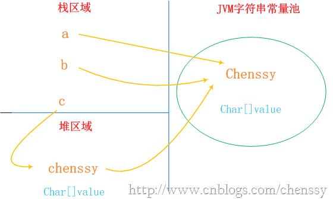

## String&StringBuffer&StringBuilder

### 不同点对比
- 可变与不可变：String是不可变字符串对象，StringBuilder和StringBuffer是可变字符串对象（其内部的字符数组长度可变）。

- 是否多线程安全：String中的对象是不可变的，也就可以理解为常量，显然线程安全。StringBuffer 与 StringBuilder 中的方法和功能完全是等价的，只是StringBuffer 中的方法大都采用了synchronized 关键字进行修饰，因此是线程安全的，而 StringBuilder 没有这个修饰，可以被认为是非线程安全的。

- String、StringBuilder、StringBuffer三者的执行效率：
StringBuilder > StringBuffer > String 当然这个是相对的，不一定在所有情况下都是这样。比如String str = "hello"+ "world"的效率就比 StringBuilder st  = new StringBuilder().append("hello").append("world")要高。因此，这三个类是各有利弊，应当根据不同的情况来进行选择使用：
当字符串相加操作或者改动较少的情况下，建议使用 String str="hello"这种形式；
当字符串相加操作较多的情况下，建议使用StringBuilder，如果采用了多线程，则使用StringBuffer。

### final的理解
对于引用类型，final只对引用的"值"(即内存地址)有效。它迫使引用只能指向初始指向的那个对象，改变它的指向会导致编译期错误。至于它所指向的对象的变化，final是不负责的。

```
final StringBuffer a = new StringBuffer("111");
final StringBuffer b = new StringBuffer("222");
a=b;//赋值语句，把a的值改为b所指向的内存地址。此句编译不通过
final StringBuffer a = new StringBuffer("111");
a.append("222");//编译通过
final String c = new String("111");
a= a+"222";//编译不通过
```


### String

1. String使用private final char value[]来实现字符串的存储，
2. String类是final类，因此不能被继承，且其成员方法默认为是final方法
3. String对象一旦被创建就固定不变，相关任何change操作都会生成新对象，原对象不受影响。
4. 单独使用""引号创建的字符串都是常量,编译期就已经确定存储到String Pool中；
5. 使用new String("")创建的对象会存储到heap中,是运行期新创建的；new创建字符串时首先查看池中是否有相同值的字符串，如果有，则拷贝一份到堆中，然后返回堆中的地址；如果池中没有，则在堆中创建一份，然后返回堆中的地址（注意，此时不需要从堆中复制到池中，否则，将使得堆中的字符串永远是池中的子集，导致浪费池的空间）！
6. Java常量池分两种：
	- 静态常量池，即*.class文件中的常量池，class文件中的常量池不仅仅包含字符串(数字)字面量，还包含类、方法的信息，占用class文件绝大部分空间。
	- 运行时常量池，则是jvm虚拟机在完成类装载操作后，将class文件中的常量池载入到内存中，并保存在方法区中，我们常说的常量池，就是指方法区中的运行时常量池。

7. 使用只包含常量的字符串连接符如"aa" + "aa"创建的是常量,编译期就能确定,已经确定存储到String Pool中；
	 
	```
	/**
	 * 编译期确定
	 */
	public void test9(){
	    String s0 = "ab"; 
	    final String s1 = "b"; //final修饰，编译时会被解析为常量，存储在常量池
	    String s2 = "a" + s1;  
	System.out.println((s0 == s2)); //result = true
	}
	```

7. 使用包含变量的字符串连接符如"aa" + s1创建的对象是运行期才创建的,存储在heap中；

	```
	/**
	 * 编译期无法确定
	 */
	public void test10(){
	    String s0 = "ab"; 
	    final String s1 = getS1(); 
	    String s2 = "a" + s1; 
		System.out.println((s0 == s2)); //result = false 
	}
	
	private static String getS1() {  
	    return "b";   
	}
	```

8. 对于直接相加字符串，效率很高，因为在编译器便确定了它的值，也就是说形如"I"+"love"+"java"; 的字符串相加，在编译期间便被优化成了"Ilovejava"。对于间接相加（即包含字符串引用），形如s1+s2+s3; 效率要比直接相加低，因为在编译器不会对引用变量进行优化。如下：

	```
	String a = "chenssy";
	String b = "chenssy";
	```
a、b和字面上的chenssy都是指向JVM字符串常量池中的"chenssy"对象，他们指向同一个对象。
	
	```
	String c = new String("chenssy");
	```	
new关键字一定会产生一个对象chenssy（注意这个chenssy和上面的chenssy不同），同时这个对象是存储在堆中,所以上面应该产生了两个对象：保存在栈中的c和保存堆中chenssy.但是在Java中根本就不存在两个完全一模一样的字符串对象。故堆中的chenssy应该是引用字符串常量池中chenssy。所以c、chenssy、池chenssy的关系应该是：c--->chenssy--->池chenssy。整个关系如下：
<div align="center">  </div>

10. equals和==
	- ==，对于基本数据类型的变量（byte,short,char,int,long,float,double,boolean)，则直接比较其存储的"值"是否相等；如果作用于引用类型的变量，则比较的是所指向的对象的地址（即是否指向同一个对象）。

	- equals方法是基类Object中的方法，因此对于所有的继承于Object的类都会有该方法。在Object类中，equals方法是用来比较两个对象的引用是否相等，即是否指向同一个对象。

	- 对于equals方法，注意：equals方法不能作用于基本数据类型的变量。如果没有对equals方法进行重写，则比较的是引用类型的变量所指向的对象的地址；而String类对equals方法进行了重写，用来比较指向的字符串对象所存储的字符串是否相等。其他的一些类诸如Double，Date，Integer等，都对equals方法进行了重写用来比较指向的对象所存储的内容是否相等。
11. 当使用+进行多个字符串连接时，实际上是产生了一个StringBuilder对象和一个String对象。首先以最左边的字符串为参数创建StringBuilder对象，然后依次对右边进行append操作，最后将StringBuilder对象通过toString()方法转换成String对象（注意：中间的多个字符串常量不会自动拼接）。
12. 字符串池的优缺点：
字符串池的优点就是避免了相同内容的字符串的创建，节省了内存，省去了创建相同字符串的时间，同时提升了性能；另一方面，字符串池的缺点就是牺牲了JVM在常量池中遍历对象所需要的时间，不过其时间成本相比而言比较低。


