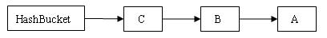
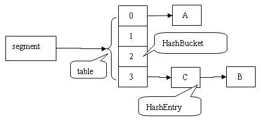
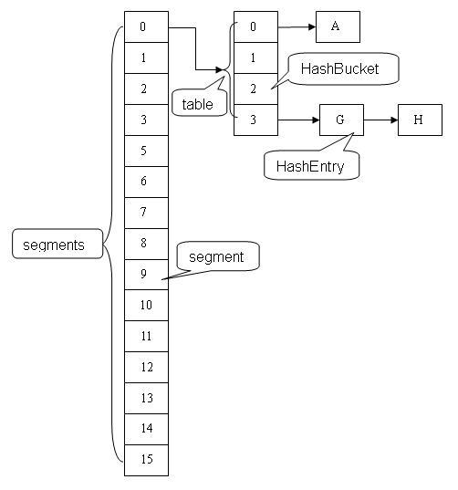

# ConcurrentHashMap 的实现原理

# 概述

我们在之前的博文中了解到关于 HashMap 和 Hashtable 这两种集合。其中 HashMap 是非线程安全的，当我们只有一个线程在使用 HashMap 的时候，自然不会有问题，但如果涉及到多个线程，并且有读有写的过程中，HashMap 就不能满足我们的需要了(fail-fast)。在不考虑性能问题的时候，我们的解决方案有 Hashtable 或者Collections.synchronizedMap(hashMap)，这两种方式基本都是对整个 hash 表结构做锁定操作的，这样在锁表的期间，别的线程就需要等待了，无疑性能不高。

所以我们在本文中学习一个 util.concurrent 包的重要成员，ConcurrentHashMap。

ConcurrentHashMap 的实现是依赖于 Java 内存模型，所以我们在了解 ConcurrentHashMap 的前提是必须了解Java 内存模型。但 Java 内存模型并不是本文的重点，所以我假设读者已经对 Java 内存模型有所了解。

# ConcurrentHashMap 分析

ConcurrentHashMap 的结构是比较复杂的，都深究去本质，其实也就是数组和链表而已。我们由浅入深慢慢的分析其结构。

先简单分析一下，ConcurrentHashMap 的成员变量中，包含了一个 Segment 的数组（final Segment<K,V>[] segments;），而 Segment 是 ConcurrentHashMap 的内部类，然后在 Segment 这个类中，包含了一个 HashEntry 的数组（transient volatile HashEntry<K,V>[] table;）。而 HashEntry 也是 ConcurrentHashMap 的内部类。HashEntry 中，包含了 key 和 value 以及 next 指针（类似于 HashMap 中 Entry），所以 HashEntry 可以构成一个链表。

所以通俗的讲，ConcurrentHashMap 数据结构为一个 Segment 数组，Segment 的数据结构为 HashEntry 的数组，而 HashEntry 存的是我们的键值对，可以构成链表。

# HashEntry

HashEntry 用来封装散列映射表中的键值对。在 HashEntry 类中，key，hash 和 next 域都被声明为 final 型，value 域被声明为 volatile 型。其类的定义为：

```
static final class HashEntry<K,V> {
        final int hash;
        final K key;
        volatile V value;
        volatile HashEntry<K,V> next;

        HashEntry(int hash, K key, V value, HashEntry<K,V> next) {
            this.hash = hash;
            this.key = key;
            this.value = value;
            this.next = next;
        }
        ...
        ...
}
```

HashEntry 的学习可以类比着 HashMap 中的 Entry。我们的存储键值对的过程中，散列的时候如果发生“碰撞”，将采用“分离链表法”来处理碰撞：把碰撞的 HashEntry 对象链接成一个链表。

如下图，我们在一个空桶中插入 A、B、C 两个 HashEntry 对象后的结构图（其实应该为键值对，在这进行了简化以方便更容易理解）：

<div align="center">  </div><br>

# Segment

Segment 的类定义为static final class Segment<K,V> extends ReentrantLock implements Serializable。其继承于 ReentrantLock 类，从而使得 Segment 对象可以充当锁的角色。Segment 中包含HashEntry 的数组，其可以守护其包含的若干个桶（HashEntry的数组）。Segment 在某些意义上有点类似于 HashMap了，都是包含了一个数组，而数组中的元素可以是一个链表。

table:table 是由 HashEntry 对象组成的数组如果散列时发生碰撞，碰撞的 HashEntry 对象就以链表的形式链接成一个链表table数组的数组成员代表散列映射表的一个桶每个 table 守护整个 ConcurrentHashMap 包含桶总数的一部分如果并发级别为 16，table 则守护 ConcurrentHashMap 包含的桶总数的 1/16。

count 变量是计算器，表示每个 Segment 对象管理的 table 数组（若干个 HashEntry 的链表）包含的HashEntry 对象的个数。之所以在每个Segment对象中包含一个 count 计数器，而不在 ConcurrentHashMap 中使用全局的计数器，是为了避免出现“热点域”而影响并发性。

```
/**
     * Segments are specialized versions of hash tables.  This
     * subclasses from ReentrantLock opportunistically, just to
     * simplify some locking and avoid separate construction.
     */
    static final class Segment<K,V> extends ReentrantLock implements Serializable {
      /**
         * The per-segment table. Elements are accessed via
         * entryAt/setEntryAt providing volatile semantics.
         */
        transient volatile HashEntry<K,V>[] table;

        /**
         * The number of elements. Accessed only either within locks
         * or among other volatile reads that maintain visibility.
         */
        transient int count;
        transient int modCount;
        /**
         * 装载因子
         */
        final float loadFactor;
    }
```

我们通过下图来展示一下插入 ABC 三个节点后，Segment 的示意图：

<div align="center">  </div><br>

其实从我个人角度来说，Segment结构是与HashMap很像的。

# ConcurrentHashMap

ConcurrentHashMap 的结构中包含的 Segment 的数组，在默认的并发级别会创建包含 16 个 Segment 对象的数组。通过我们上面的知识，我们知道每个 Segment 又包含若干个散列表的桶，每个桶是由 HashEntry 链接起来的一个链表。如果 key 能够均匀散列，每个 Segment 大约守护整个散列表桶总数的 1/16。

下面我们还有通过一个图来演示一下 ConcurrentHashMap 的结构：

<div align="center">  </div><br>

# 并发写操作

在 ConcurrentHashMap 中，当执行 put 方法的时候，会需要加锁来完成。我们通过代码来解释一下具体过程： 当我们 new 一个 ConcurrentHashMap 对象，并且执行put操作的时候，首先会执行 ConcurrentHashMap 类中的 put 方法，该方法源码为：

```
/**
     * Maps the specified key to the specified value in this table.
     * Neither the key nor the value can be null.
     *
     * <p> The value can be retrieved by calling the <tt>get</tt> method
     * with a key that is equal to the original key.
     *
     * @param key key with which the specified value is to be associated
     * @param value value to be associated with the specified key
     * @return the previous value associated with <tt>key</tt>, or
     *         <tt>null</tt> if there was no mapping for <tt>key</tt>
     * @throws NullPointerException if the specified key or value is null
     */
    @SuppressWarnings("unchecked")
    public V put(K key, V value) {
        Segment<K,V> s;
        if (value == null)
            throw new NullPointerException();
        int hash = hash(key);
        int j = (hash >>> segmentShift) & segmentMask;
        if ((s = (Segment<K,V>)UNSAFE.getObject          // nonvolatile; recheck
             (segments, (j << SSHIFT) + SBASE)) == null) //  in ensureSegment
            s = ensureSegment(j);
        return s.put(key, hash, value, false);
    }
```

我们通过注释可以了解到，ConcurrentHashMap 不允许空值。该方法首先有一个 Segment 的引用 s，然后会通过 hash() 方法对 key 进行计算，得到哈希值；继而通过调用 Segment 的 put(K key, int hash, V value, boolean onlyIfAbsent)方法进行存储操作。该方法源码为：

```
final V put(K key, int hash, V value, boolean onlyIfAbsent) {
    //加锁，这里是锁定的Segment而不是整个ConcurrentHashMap
    HashEntry<K,V> node = tryLock() ? null :scanAndLockForPut(key, hash, value);
    V oldValue;
    try {
        HashEntry<K,V>[] tab = table;
        //得到hash对应的table中的索引index
        int index = (tab.length - 1) & hash;
        //找到hash对应的是具体的哪个桶，也就是哪个HashEntry链表
        HashEntry<K,V> first = entryAt(tab, index);
        for (HashEntry<K,V> e = first;;) {
            if (e != null) {
                K k;
                if ((k = e.key) == key ||
                    (e.hash == hash && key.equals(k))) {
                    oldValue = e.value;
                    if (!onlyIfAbsent) {
                        e.value = value;
                        ++modCount;
                    }
                    break;
                }
                e = e.next;
            }
            else {
                if (node != null)
                    node.setNext(first);
                else
                    node = new HashEntry<K,V>(hash, key, value, first);
                int c = count + 1;
                if (c > threshold && tab.length < MAXIMUM_CAPACITY)
                    rehash(node);
                else
                    setEntryAt(tab, index, node);
                ++modCount;
                count = c;
                oldValue = null;
                break;
            }
        }
    } finally {
        //解锁
        unlock();
    }
    return oldValue;
}
```

关于该方法的某些关键步骤，在源码上加上了注释。

需要注意的是：加锁操作是针对的 hash 值对应的某个 Segment，而不是整个 ConcurrentHashMap。因为 put 操作只是在这个 Segment 中完成，所以并不需要对整个 ConcurrentHashMap 加锁。所以，此时，其他的线程也可以对另外的 Segment 进行 put 操作，因为虽然该 Segment 被锁住了，但其他的 Segment 并没有加锁。同时，读线程并不会因为本线程的加锁而阻塞。

正是因为其内部的结构以及机制，所以 ConcurrentHashMap 在并发访问的性能上要比Hashtable和同步包装之后的HashMap的性能提高很多。在理想状态下，ConcurrentHashMap 可以支持 16 个线程执行并发写操作（如果并发级别设置为 16），及任意数量线程的读操作。

# 总结

在实际的应用中，散列表一般的应用场景是：除了少数插入操作和删除操作外，绝大多数都是读取操作，而且读操作在大多数时候都是成功的。正是基于这个前提，ConcurrentHashMap 针对读操作做了大量的优化。通过 HashEntry 对象的不变性和用 volatile 型变量协调线程间的内存可见性，使得 大多数时候，读操作不需要加锁就可以正确获得值。这个特性使得 ConcurrentHashMap 的并发性能在分离锁的基础上又有了近一步的提高。

ConcurrentHashMap 是一个并发散列映射表的实现，它允许完全并发的读取，并且支持给定数量的并发更新。相比于 HashTable 和用同步包装器包装的 HashMap（Collections.synchronizedMap(new HashMap())），ConcurrentHashMap 拥有更高的并发性。在 HashTable 和由同步包装器包装的 HashMap 中，使用一个全局的锁来同步不同线程间的并发访问。同一时间点，只能有一个线程持有锁，也就是说在同一时间点，只能有一个线程能访问容器。这虽然保证多线程间的安全并发访问，但同时也导致对容器的访问变成串行化的了。

ConcurrentHashMap 的高并发性主要来自于三个方面：

    用分离锁实现多个线程间的更深层次的共享访问。
    用 HashEntery 对象的不变性来降低执行读操作的线程在遍历链表期间对加锁的需求。
    通过对同一个 Volatile 变量的写 / 读访问，协调不同线程间读 / 写操作的内存可见性。

使用分离锁，减小了请求 同一个锁的频率。

通过 HashEntery 对象的不变性及对同一个 Volatile 变量的读 / 写来协调内存可见性，使得 读操作大多数时候不需要加锁就能成功获取到需要的值。由于散列映射表在实际应用中大多数操作都是成功的 读操作，所以 2 和 3 既可以减少请求同一个锁的频率，也可以有效减少持有锁的时间。通过减小请求同一个锁的频率和尽量减少持有锁的时间 ，使得 ConcurrentHashMap 的并发性相对于 HashTable 和用同步包装器包装的 HashMap有了质的提高。

# 在jdk1.8中主要做了2方面的改进

改进一：取消segments字段，直接采用transient volatile HashEntry<K,V>[] table保存数据，采用table数组元素作为锁，从而实现了对每一行数据进行加锁，进一步减少并发冲突的概率。

改进二：将原先table数组＋单向链表的数据结构，变更为table数组＋单向链表＋红黑树的结构。对于hash表来说，最核心的能力在于将key hash之后能均匀的分布在数组中。如果hash之后散列的很均匀，那么table数组中的每个队列长度主要为0或者1。但实际情况并非总是如此理想，虽然ConcurrentHashMap类默认的加载因子为0.75，但是在数据量过大或者运气不佳的情况下，还是会存在一些队列长度过长的情况，如果还是采用单向列表方式，那么查询某个节点的时间复杂度为O(n)；因此，对于个数超过8(默认值)的列表，jdk1.8中采用了红黑树的结构，那么查询的时间复杂度可以降低到O(logN)，可以改进性能。

为了说明以上2个改动，看一下put操作是如何实现的。

```
final V putVal(K key, V value, boolean onlyIfAbsent) {
    if (key == null || value == null) throw new NullPointerException();
    int hash = spread(key.hashCode());
    int binCount = 0;
    for (Node<K,V>[] tab = table;;) {
        Node<K,V> f; int n, i, fh;
        // 如果table为空，初始化；否则，根据hash值计算得到数组索引i，如果tab[i]为空，直接新建节点Node即可。注：tab[i]实质为链表或者红黑树的首节点。
        if (tab == null || (n = tab.length) == 0)
            tab = initTable();
        else if ((f = tabAt(tab, i = (n - 1) & hash)) == null) {
            if (casTabAt(tab, i, null,
                         new Node<K,V>(hash, key, value, null)))
                break;                   // no lock when adding to empty bin
        }
        // 如果tab[i]不为空并且hash值为MOVED，说明该链表正在进行transfer操作，返回扩容完成后的table。
        else if ((fh = f.hash) == MOVED)
            tab = helpTransfer(tab, f);
        else {
            V oldVal = null;
            // 针对首个节点进行加锁操作，而不是segment，进一步减少线程冲突
            synchronized (f) {
                if (tabAt(tab, i) == f) {
                    if (fh >= 0) {
                        binCount = 1;
                        for (Node<K,V> e = f;; ++binCount) {
                            K ek;
                            // 如果在链表中找到值为key的节点e，直接设置e.val = value即可。
                            if (e.hash == hash &&
                                ((ek = e.key) == key ||
                                 (ek != null && key.equals(ek)))) {
                                oldVal = e.val;
                                if (!onlyIfAbsent)
                                    e.val = value;
                                break;
                            }
                            // 如果没有找到值为key的节点，直接新建Node并加入链表即可。
                            Node<K,V> pred = e;
                            if ((e = e.next) == null) {
                                pred.next = new Node<K,V>(hash, key,
                                                          value, null);
                                break;
                            }
                        }
                    }
                    // 如果首节点为TreeBin类型，说明为红黑树结构，执行putTreeVal操作。
                    else if (f instanceof TreeBin) {
                        Node<K,V> p;
                        binCount = 2;
                        if ((p = ((TreeBin<K,V>)f).putTreeVal(hash, key,
                                                       value)) != null) {
                            oldVal = p.val;
                            if (!onlyIfAbsent)
                                p.val = value;
                        }
                    }
                }
            }
            if (binCount != 0) {
                // 如果节点数>＝8，那么转换链表结构为红黑树结构。
                if (binCount >= TREEIFY_THRESHOLD)
                    treeifyBin(tab, i);
                if (oldVal != null)
                    return oldVal;
                break;
            }
        }
    }
    // 计数增加1，有可能触发transfer操作(扩容)。
    addCount(1L, binCount);
    return null;
}
```

另外，在其他方面也有一些小的改进，比如新增字段 transient volatile CounterCell[] counterCells; 可方便的计算hashmap中所有元素的个数，性能大大优于jdk1.7中的size()方法。


