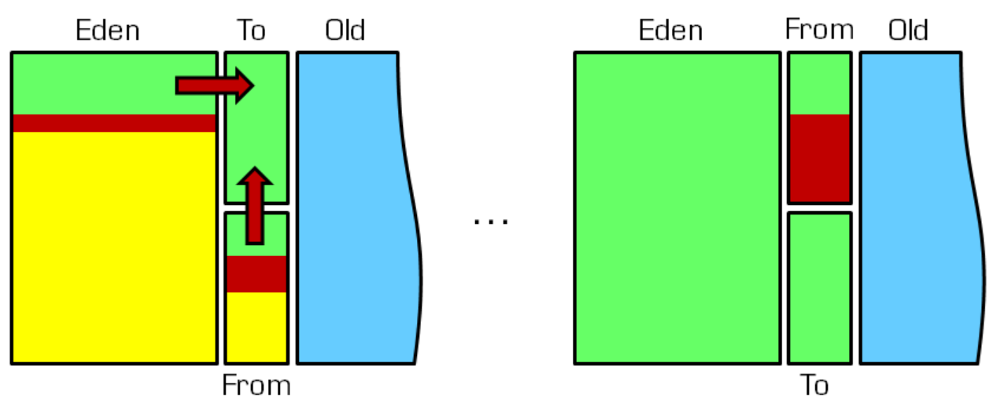

# java垃圾回收算法

Java虚拟机的内存区域中，程序计数器、虚拟机栈和本地方法栈三个区域是线程私有的，随线程生而生，随线程灭而灭；栈中的栈帧随着方法的进入和退出而进行入栈和出栈操作，每个栈帧中分配多少内存基本上是在类结构确定下来时就已知的，因此这三个区域的内存分配和回收都具有确定性。垃圾回收重点关注的是堆和方法区部分的内存。

# 常用的垃圾回收算法有：

## (1).引用计数算法：

给对象中添加一个引用计数器，每当有一个地方引用它时，计数器值就加1；当引用失效时，计数器值就减1；任何时刻计数器都为0的对象就是不再被使用的，垃圾收集器将回收该对象使用的内存。

引用计数算法实现简单，效率很高，微软的COM技术、ActionScript、Python等都使用了引用计数算法进行内存管理，但是引用计数算法对于对象之间相互循环引用问题难以解决，因此java并没有使用引用计数算法。

## (2).根搜索算法：

通过一系列的名为“GC Root”的对象作为起点，从这些节点向下搜索，搜索所走过的路径称为引用链(Reference Chain)，当一个对象到GC Root没有任何引用链相连时，则该对象不可达，该对象是不可使用的，垃圾收集器将回收其所占的内存。

主流的商用程序语言C#、java和Lisp都使用根搜素算法进行内存管理。

在java语言中，可作为GC Root的对象包括以下几种对象：

a. java虚拟机栈(栈帧中的本地变量表)中的引用的对象。

b.方法区中的类静态属性引用的对象。

c.方法区中的常量引用的对象。

d.本地方法栈中JNI本地方法的引用对象。

java方法区在Sun HotSpot虚拟机中被称为永久代，很多人认为该部分的内存是不用回收的，java虚拟机规范也没有对该部分内存的垃圾收集做规定，但是方法区中的废弃常量和无用的类还是需要回收以保证永久代不会发生内存溢出。

判断废弃常量的方法：如果常量池中的某个常量没有被任何引用所引用，则该常量是废弃常量。

判断无用的类：

(1).该类的所有实例都已经被回收，即java堆中不存在该类的实例对象。

(2).加载该类的类加载器已经被回收。

(3).该类所对应的java.lang.Class对象没有任何地方被引用，无法在任何地方通过反射机制访问该类的方法。

# Java中常用的垃圾收集算法：

## (1).标记-清除算法：

最基础的垃圾收集算法，算法分为“标记”和“清除”两个阶段：首先标记出所有需要回收的对象，在标记完成之后统一回收掉所有被标记的对象。

标记-清除算法的缺点有两个：首先，效率问题，标记和清除效率都不高。其次，标记清除之后会产生大量的不连续的内存碎片，空间碎片太多会导致当程序需要为较大对象分配内存时无法找到足够的连续内存而不得不提前触发另一次垃圾收集动作。

## (2).标记-整理算法：

标记-整理算法在标记-清除算法基础上做了改进，标记阶段是相同的标记出所有需要回收的对象，在标记完成之后不是直接对可回收对象进行清理，而是让所有存活的对象都向一端移动，在移动过程中清理掉可回收的对象，这个过程叫做整理。

标记-整理算法相比标记-清除算法的优点是内存被整理以后不会产生大量不连续内存碎片问题。

复制算法在对象存活率高的情况下就要执行较多的复制操作，效率将会变低，而在对象存活率高的情况下使用标记-整理算法效率会大大提高。

## (3).复制算法：

将可用内存按容量分成大小相等的两块，每次只使用其中一块，当这块内存使用完了，就将还存活的对象复制到另一块内存上去，然后把使用过的内存空间一次清理掉。这样使得每次都是对其中一块内存进行回收，内存分配时不用考虑内存碎片等复杂情况，只需要移动堆顶指针，按顺序分配内存即可，实现简单，运行高效。

复制算法的缺点显而易见，可使用的内存降为原来一半。

## (4).分代收集算法：

根据内存中对象的存活周期不同，将内存划分为几块，java的虚拟机中一般把内存划分为新生代和年老代，当新创建对象时一般在新生代中分配内存空间，当新生代垃圾收集器回收几次之后仍然存活的对象会被移动到年老代内存中，当大对象在新生代中无法找到足够的连续内存时也直接在年老代中创建。

现在的Java虚拟机就联合使用了分代复制、标记-清除和标记-整理算法，java虚拟机垃圾收集器关注的内存结构如下：

  
 

堆内存被分成新生代和年老代两个部分，整个堆内存使用分代复制垃圾收集算法。

### (1).新生代：

新生代使用复制和标记-清除垃圾收集算法，研究表明，新生代中98%的对象是朝生夕死的短生命周期对象，所以不需要将新生代划分为容量大小相等的两部分内存，而是将新生代分为Eden区，Survivor from和Survivor to三部分，其占新生代内存容量默认比例分别为8：1：1，其中Survivor from和Survivor to总有一个区域是空白，只有Eden和其中一个Survivor总共90%的新生代容量用于为新创建的对象分配内存，只有10%的Survivor内存浪费，当新生代内存空间不足需要进行垃圾回收时，仍然存活的对象被复制到空白的Survivor内存区域中，Eden和非空白的Survivor进行标记-清理回收，两个Survivor区域是轮换的。

新生代中98%情况下空白Survivor都可以存放垃圾回收时仍然存活的对象，2%的极端情况下，如果空白Survivor空间无法存放下仍然存活的对象时，使用内存分配担保机制，直接将新生代依然存活的对象复制到年老代内存中，同时对于创建大对象时，如果新生代中无足够的连续内存时，也直接在年老代中分配内存空间。

Java虚拟机对新生代的垃圾回收称为Minor GC，次数比较频繁，每次回收时间也比较短。

使用java虚拟机-Xmn参数可以指定新生代内存大小。

### (2).年老代：

年老代中的对象一般都是长生命周期对象，对象的存活率比较高，因此在年老代中使用标记-整理垃圾回收算法。

Java虚拟机对年老代的垃圾回收称为MajorGC/Full GC，次数相对比较少，每次回收的时间也比较长。

当新生代中无足够空间为对象创建分配内存，年老代中内存回收也无法回收到足够的内存空间，并且新生代和年老代空间无法在扩展时，堆就会产生OutOfMemoryError异常。

java虚拟机-Xms参数可以指定最小内存大小，-Xmx参数可以指定最大内存大小，这两个参数分别减去Xmn参数指定的新生代内存大小，可以计算出年老代最小和最大内存容量。

### (3).永久代：

java虚拟机内存中的方法区在Sun HotSpot虚拟机中被称为永久代，是被各个线程共享的内存区域，它用于存储已被虚拟机加载的类信息、常量、静态变量、即时编译后的代码等数据。永久代垃圾回收比较少，效率也比较低，但是也必须进行垃圾回收，否则会永久代内存不够用时仍然会抛出OutOfMemoryError异常。

永久代也使用标记-整理算法进行垃圾回收，java虚拟机参数-XX:PermSize和-XX:MaxPermSize可以设置永久代的初始大小和最大容量。

