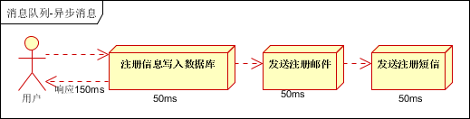

# 消息队列概述

消息队列中间件是分布式系统中重要的组件，主要解决应用耦合，异步消息，流量削锋等问题。实现高性能，高可用，可伸缩和最终一致性架构。是大型分布式系统不可缺少的中间件。

目前在生产环境，使用较多的消息队列有ActiveMQ，RabbitMQ，ZeroMQ，Kafka，MetaMQ，RocketMQ等。

# 消息队列是怎么工作？

消息队列系统，一般都包含3个角色：队列服务端，队列的生产者，队列的消费者。

　　消息队列系统类似于这个场景：有一条信息传送带不停地运转。在传送带的起点，工人a不断地把信息放在一个盒子，把盒子放到传送带上，盒子被传送带传送到终点。在终点上，工人b把盒子上的信息取出来，进行处理。

　　在上面的场景中，不停运转的传送带就是队列服务端，在传送带起点不断放盒子的工人a就是队列的生产者，在传送带终点不断取盒子的工人b就是队列的消费者。

　　消息队列的服务端，现在有大量的开源的应用，例如RabbitMQ ，ZeroMQ ，redis等。

　　队列的生产者和服务者，是针对消息队列服务端开发的客户端，例如，RabbitMQ就有针对java，php等语言开发的客户端。

　　例如，在app后端中，用代码调用 java客户端，把要发送的短信信息放在ZeroMQ中，这里java客户端是充当队列的生产者。

　　写一个守护进程，在守护进程中，通过代码调用 java客户端把要发送的短信信息不断地从ZeroMQ取出来，然后发送出去。

# 为什么要用消息队列？

假设一个老大，接到一个任务要处理完。在处理这个任务时，把这个任务分解为几个小任务，只要分别完成了这几个小任务，整个任务也就完成了。

　　做到某个小任务时，发现这个小任务需要花很多时间完成，而且这个小任务迟点完成也不影响整个任务的完成进度。于是，老大把这个小任务交个一个小弟去做，自己去接着完成其他的任务。

　　在上面的例子中，老大就是后台系统，小弟就是消息队列系统，当后台系统发现完成某些小任务需要花很多时间，而且迟点完成也不影响整个任务的，就会把这些小任务交给消息队列系统。

　　在实际的app后端中，发送邮件，发送短信，推送等这些任务，都非常适合在消息队列系统中做的。大家想想，这些任务是不是都需要花比较多的时间，而且迟点完成也不影响的。把这些任务放在队列中，可加快请求的响应时间。

# 消息队列应用场景

以下介绍消息队列在实际应用中常用的使用场景。异步处理，应用解耦，流量削锋和消息通讯四个场景。

## 异步处理

场景说明：用户注册后，需要发注册邮件和注册短信。传统的做法有两种1.串行的方式；2.并行方式。

串行方式：将注册信息写入数据库成功后，发送注册邮件，再发送注册短信。以上三个任务全部完成后，返回给客户端。

  
 

并行方式：将注册信息写入数据库成功后，发送注册邮件的同时，发送注册短信。以上三个任务完成后，返回给客户端。与串行的差别是，并行的方式可以提高处理的时间。

  
 

假设三个业务节点每个使用50毫秒钟，不考虑网络等其他开销，则串行方式的时间是150毫秒，并行的时间可能是100毫秒。
因为CPU在单位时间内处理的请求数是一定的，假设CPU1秒内吞吐量是100次。则串行方式1秒内CPU可处理的请求量是7次（1000/150）。并行方式处理的请求量是10次（1000/100）。

小结：如以上案例描述，传统的方式系统的性能（并发量，吞吐量，响应时间）会有瓶颈。如何解决这个问题呢？
引入消息队列，将不是必须的业务逻辑，异步处理。改造后的架构如下：

  
 

按照以上约定，用户的响应时间相当于是注册信息写入数据库的时间，也就是50毫秒。注册邮件，发送短信写入消息队列后，直接返回，因此写入消息队列的速度很快，基本可以忽略，因此用户的响应时间可能是50毫秒。因此架构改变后，系统的吞吐量提高到每秒20 QPS。比串行提高了3倍，比并行提高了两倍。

## 应用解耦

场景说明：用户下单后，订单系统需要通知库存系统。传统的做法是，订单系统调用库存系统的接口。如下图：

  
 

传统模式的缺点：

假如库存系统无法访问，则订单减库存将失败，从而导致订单失败；

订单系统与库存系统耦合；

如何解决以上问题呢？引入应用消息队列后的方案，如下图：

  
 

订单系统：用户下单后，订单系统完成持久化处理，将消息写入消息队列，返回用户订单下单成功。

库存系统：订阅下单的消息，采用拉/推的方式，获取下单信息，库存系统根据下单信息，进行库存操作。

假如：在下单时库存系统不能正常使用。也不影响正常下单，因为下单后，订单系统写入消息队列就不再关心其他的后续操作了。实现订单系统与库存系统的应用解耦。

## 流量削锋

流量削锋也是消息队列中的常用场景，一般在秒杀或团抢活动中使用广泛。

应用场景：秒杀活动，一般会因为流量过大，导致流量暴增，应用挂掉。为解决这个问题，一般需要在应用前端加入消息队列。
可以控制活动的人数；

可以缓解短时间内高流量压垮应用；

  
 

用户的请求，服务器接收后，首先写入消息队列。假如消息队列长度超过最大数量，则直接抛弃用户请求或跳转到错误页面；
秒杀业务根据消息队列中的请求信息，再做后续处理。

## 日志处理

日志处理是指将消息队列用在日志处理中，比如Kafka的应用，解决大量日志传输的问题。架构简化如下：

  
 

日志采集客户端，负责日志数据采集，定时写受写入Kafka队列；

Kafka消息队列，负责日志数据的接收，存储和转发；

日志处理应用：订阅并消费kafka队列中的日志数据；

以下是新浪kafka日志处理应用案例：

  
 

Kafka：接收用户日志的消息队列。

Logstash：做日志解析，统一成JSON输出给Elasticsearch。

Elasticsearch：实时日志分析服务的核心技术，一个schemaless，实时的数据存储服务，通过index组织数据，兼具强大的搜索和统计功能。

Kibana：基于Elasticsearch的数据可视化组件，超强的数据可视化能力是众多公司选择ELK stack的重要原因。
消息通讯

消息通讯是指，消息队列一般都内置了高效的通信机制，因此也可以用在纯的消息通讯。比如实现点对点消息队列，或者聊天室等。
点对点通讯：

  
 

客户端A和客户端B使用同一队列，进行消息通讯。

聊天室通讯：

  
 

客户端A，客户端B，客户端N订阅同一主题，进行消息发布和接收。实现类似聊天室效果。

以上实际是消息队列的两种消息模式，点对点或发布订阅模式。模型为示意图，供参考。

# JMS消息服务

讲消息队列就不得不提JMS 。JMS（JAVA Message Service,java消息服务）API是一个消息服务的标准/规范，允许应用程序组件基于JavaEE平台创建、发送、接收和读取消息。它使分布式通信耦合度更低，消息服务更加可靠以及异步性。

在EJB架构中，有消息bean可以无缝的与JM消息服务集成。在J2EE架构模式中，有消息服务者模式，用于实现消息与应用直接的解耦。

JMS具有两种通信模式：

Point-to-Point Messaging Domain （点对点）

Publish/Subscribe Messaging Domain （发布/订阅模式）

在JMS API出现之前，大部分产品使用“点对点”和“发布/订阅”中的任一方式来进行消息通讯。JMS定义了这两种消息发送模型的规范，它们相互独立。任何JMS的提供者可以实现其中的一种或两种模型，这是它们自己的选择。JMS规范提供了通用接口保证我们基于JMS API编写的程序适用于任何一种模型。

# 消息模型

在JMS标准中，有两种消息模型P2P（Point to Point）：

## P2P模式

  
 

P2P模式包含三个角色：消息队列（Queue），发送者(Sender)，接收者(Receiver)。每个消息都被发送到一个特定的队列，接收者从队列中获取消息。队列保留着消息，直到他们被消费或超时。

P2P的特点

每个消息只有一个消费者（Consumer）(即一旦被消费，消息就不再在消息队列中)；

发送者和接收者之间在时间上没有依赖性，也就是说当发送者发送了消息之后，不管接收者有没有正在运行，它不会影响到消息被发送到队列；

接收者在成功接收消息之后需向队列应答成功。

如果希望发送的每个消息都会被成功处理的话，那么需要P2P模式。

## Pub/sub模式

  
 

包含三个角色主题（Topic），发布者（Publisher），订阅者（Subscriber） 。多个发布者将消息发送到Topic,系统将这些消息传递给多个订阅者。

Pub/Sub的特点

每个消息可以有多个消费者；

发布者和订阅者之间有时间上的依赖性。针对某个主题（Topic）的订阅者，它必须创建一个订阅者之后，才能消费发布者的消息；

为了消费消息，订阅者必须保持运行的状态。

为了缓和这样严格的时间相关性，JMS允许订阅者创建一个可持久化的订阅。这样，即使订阅者没有被激活（运行），它也能接收到发布者的消息。

如果希望发送的消息可以不被做任何处理、或者只被一个消息者处理、或者可以被多个消费者处理的话，那么可以采用Pub/Sub模型。

# 消息消费

在JMS中，消息的产生和消费都是异步的。对于消费来说，JMS的消息者可以通过两种方式来消费消息。

同步（Synchronous）

订阅者或接收者通过receive方法来接收消息，receive方法在接收到消息之前（或超时之前）将一直阻塞；

异步（Asynchronous）

订阅者或接收者可以注册为一个消息监听器。当消息到达之后，系统自动调用监听器的onMessage方法。

JNDI：Java命名和目录接口,是一种标准的Java命名系统接口。可以在网络上查找和访问服务。通过指定一个资源名称，该名称对应于数据库或命名服务中的一个记录，同时返回资源连接建立所必须的信息。

JNDI在JMS中起到查找和访问发送目标或消息来源的作用。

# JMS编程模型

  
 

1.管理对象（Administered objects）-连接工厂（Connection Factories）和目的地（Destination）

2.连接对象（Connections）

3.会话（Sessions）

4.消息生产者（Message Producers）

5.消息消费者（Message Consumers）

6.消息监听者（Message Listeners）

ConnectionFactory

创建Connection对象的工厂，针对两种不同的jms消息模型，分别有QueueConnectionFactory和TopicConnectionFactory两种。可以通过JNDI来查找ConnectionFactory对象。

Destination

Destination的意思是消息生产者的消息发送目标或者说消息消费者的消息来源。对于消息生产者来说，它的Destination是某个队列（Queue）或某个主题（Topic）;对于消息消费者来说，它的Destination也是某个队列或主题（即消息来源）。

所以，Destination实际上就是两种类型的对象：Queue、Topic可以通过JNDI来查找Destination。

Connection

Connection表示在客户端和JMS系统之间建立的链接（对TCP/IP socket的包装）。Connection可以产生一个或多个Session。跟ConnectionFactory一样，Connection也有两种类型：QueueConnection和TopicConnection。

Session

Session是操作消息的接口。可以通过session创建生产者、消费者、消息等。Session提供了事务的功能。当需要使用session发送/接收多个消息时，可以将这些发送/接收动作放到一个事务中。同样，也分QueueSession和TopicSession。

消息的生产者

消息生产者由Session创建，并用于将消息发送到Destination。同样，消息生产者分两种类型：QueueSender和TopicPublisher。可以调用消息生产者的方法（send或publish方法）发送消息。

消息消费者

消息消费者由Session创建，用于接收被发送到Destination的消息。两种类型：QueueReceiver和TopicSubscriber。可分别通过session的createReceiver(Queue)或createSubscriber(Topic)来创建。当然，也可以session的creatDurableSubscriber方法来创建持久化的订阅者。

MessageListener

消息监听器。如果注册了消息监听器，一旦消息到达，将自动调用监听器的onMessage方法。EJB中的MDB（Message-Driven Bean）就是一种MessageListener。

深入学习JMS对掌握JAVA架构，EJB架构有很好的帮助，消息中间件也是大型分布式系统必须的组件。

# 常用消息队列

## Kafka

Kafka作为时下最流行的开源消息系统，被广泛地应用在数据缓冲、异步通信、汇集日志、系统解耦等方面。相比较于RocketMQ等其他常见消息系统，Kafka在保障了大部分功能特性的同时，还提供了超一流的读写性能。

Kafka是一种分布式的，基于发布/订阅的消息系统。主要设计目标如下：

以时间复杂度为O(1)的方式提供消息持久化能力，即使对TB级以上数据也能保证常数时间复杂度的访问性能。

高吞吐率。即使在非常廉价的商用机器上也能做到单机支持每秒100K条以上消息的传输。

支持Kafka Server间的消息分区，及分布式消费，同时保证每个Partition内的消息顺序传输。

同时支持离线数据处理和实时数据处理。

Scale out：支持在线水平扩展。

很明显的看出kafka的性能远超rabbitmq。不过这也是理所当然的，毕竟2个消息队列实现的协议是不一样的，处理消息的场景也大有不同。rabbitmq适合处理一些数据严谨的消息，比如说支付消息，社交消息等不能丢失的数据。kafka是批量操作切不报证数据是否能完整的到达消费者端，所以适合一些大量的营销消息的场景。

## RabbitMQ

RabbitMQ是使用Erlang编写的一个开源的消息队列，本身支持很多的协议：AMQP，XMPP, SMTP, STOMP，也正因如此，它非常重量级，更适合于企业级的开发。同时实现了Broker构架，这意味着消息在发送给客户端时先在中心队列排队。对路由，负载均衡或者数据持久化都有很好的支持。

它支持开放的高级消息队列协议 (AMQP，Advanced Message Queuing Protocol)，从根本上避免了生产厂商的封闭，使用任何语言的各种客户都可以从中受益。这种协议提供了相当复杂的消息传输模式，所以基本上不需要MassTransit或NServiceBus的配合。它还具有“企业级”的适应性和稳定性。这些东西对我的客户来说十分的有吸引力。

## ZeroMQ

号称最快的消息队列系统，尤其针对大吞吐量的需求场景。跟其它几个接受测试的产品不同，你不需要安装和运行一个消息服务器，或中间件。你只需要简单的引用ZeroMQ程序库，可以使用NuGet安装，然后你就可以愉快的在应用程序之间发送消息了。非常有趣的是，他们也同样使用这方式在任何利用ZeroMQ进行强大的进程内通信的语言里创建Erlang风格的这种执行角色。ZeroMQ和其它的不是一个级别。它的性能惊人的高。公平的说，ZeroMQ跟其它几个比起来像头巨兽，尽管这样，结论很清楚：如果你希望一个应用程序发送消息越快越好，你选择ZeroMQ。当你不太在意偶然会丢失某些消息的情况下更有价值。其中，Twitter的Storm中使用ZeroMQ作为数据流的传输。

## ActiveMQ

Java世界的中坚力量。基于JMS协议。它有很长的历史，而且被广泛的使用。它还是跨平台的，给那些非微软平台的产品提供了一个天然的集成接入点。然而，它只有跑过了MSMQ才有可能被考虑。

ActiveMQ是Apache下的一个子项目。

类似于ZeroMQ，它能够以代理人和点对点的技术实现队列。同时类似于RabbitMQ，它少量代码就可以高效地实现高级应用场景。

## Jafka

Jafka是在Kafka之上孵化而来的，即Kafka的一个升级版。具有以下特性：快速持久化，可以在O(1)的系统开销下进行消息持久化；高吞吐，在一台普通的服务器上既可以达到10W/s的吞吐速率；完全的分布式系统，Broker、Producer、Consumer都原生自动支持分布式，自动实现负载均衡；支持Hadoop数据并行加载，对于像Hadoop的一样的日志数据和离线分析系统，但又要求实时处理的限制，这是一个可行的解决方案。

## MSMQ

这是微软的产品里唯一被认为有价值的东西。对我的客户来说，如果MSMQ能证明可以应对这种任务，他们将选择使用它。关键是这个东西并不复杂，除了接收和发送，没有别的；它有一些硬性限制，比如最大消息体积是4MB。然而，通过和一些像MassTransit或NServiceBus这样的软件的连接，它完全可以解决这些问题。

## Redis

是一个Key-Value的NoSQL数据库，开发维护很活跃，虽然它是一个Key-Value数据库存储系统，但它本身支持MQ功能，所以完全可以当做一个轻量级的队列服务来使用。对于RabbitMQ和Redis的入队和出队操作，各执行100万次，每10万次记录一次执行时间。测试数据分为128Bytes、512Bytes、1K和10K四个不同大小的数据。实验表明：入队时，当数据比较小时Redis的性能要高于RabbitMQ，而如果数据大小超过了10K，Redis则慢的无法忍受；出队时，无论数据大小，Redis都表现出非常好的性能，而RabbitMQ的出队性能则远低于Redis。

