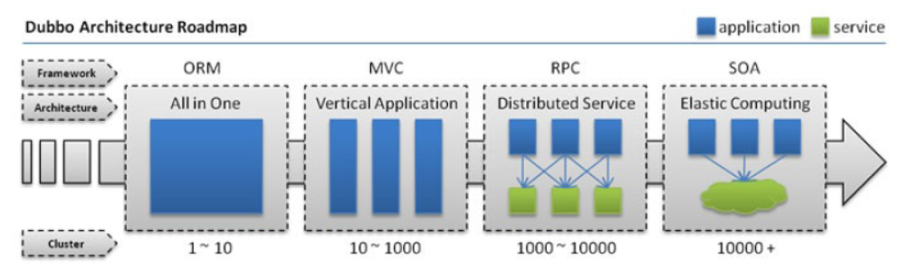
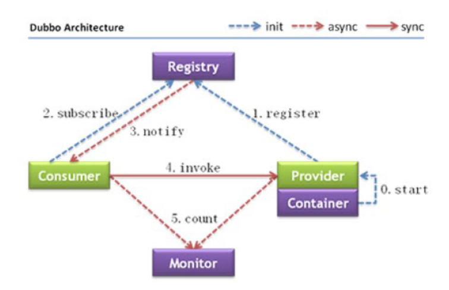
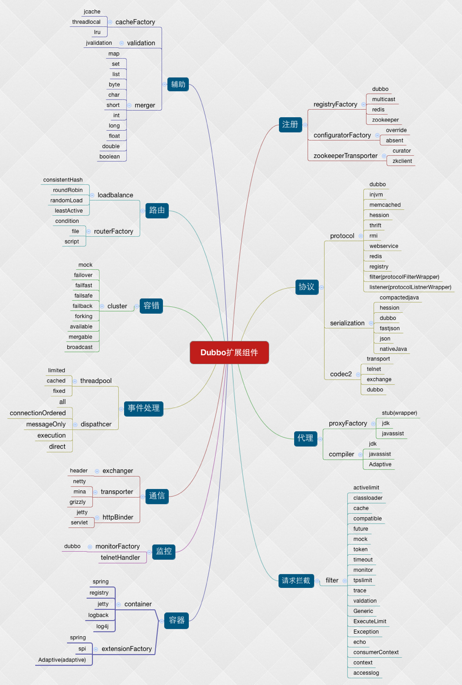

# 什么是dubbo

dubbo是一个分布式服务框架，致力于提供高性能透明化RPC远程调用方案，提供SOA服务治理解决方案。本文旨在将对dubbo的使用和学习总结起来，深入源码探究原理，以备今后可以作为借鉴用于工作之中。

# 背景

随着互联⽹的发展，⽹站应⽤的规模不断扩⼤，常规的垂直应⽤架构已⽆法应对，分布式服务架构以及流动计算架构势在必⾏，亟需⼀个治理系统确保架构有条不紊的演进。

  
 

## 单⼀应⽤架构

当⽹站流量很⼩时，只需⼀个应⽤，将所有功能都部署在⼀起，以减少部署节点和成本。此时，⽤于简化增删改查⼯作量的数据访问框架(ORM)是关键。

## 垂直应⽤架构

当访问量逐渐增⼤，单⼀应⽤增加机器带来的加速度越来越⼩，将应⽤拆成互不相⼲的⼏个应⽤，以提升效率。此时，⽤于加速前端⻚⾯开发的Web框架(MVC)是关键。

## 分布式服务架构

当垂直应⽤越来越多，应⽤之间交互不可避免，将核⼼业务抽取出来，作为独⽴的服务，逐渐形成稳定的服务中⼼，使前端应⽤能更快速的响应多变的市场需求。此时，⽤于提⾼业务复⽤及整合的分布式服务框架(RPC)是关键。

## 流动计算架构

当服务越来越多，容量的评估，⼩服务资源的浪费等问题逐渐显现，此时需增加⼀个调度中⼼基于访问压⼒实时管理集群容量，提⾼集群利⽤率。此时，⽤于提⾼机器利⽤率的资源调度和治理中⼼(SOA)是关键。

# 架构

  
 

## 节点⻆⾊说明

Provider 暴露服务的服务提供⽅

Consumer 调⽤远程服务的服务消费⽅

Registry 服务注册与发现的注册中⼼

Monitor 统计服务的调⽤次调和调⽤时间的监控中⼼

Container 服务运⾏容器

## 调⽤关系说明

1. 服务容器负责启动，加载，运⾏服务提供者。

2. 服务提供者在启动时，向注册中⼼注册⾃⼰提供的服务。

3. 服务消费者在启动时，向注册中⼼订阅⾃⼰所需的服务。

4. 注册中⼼返回服务提供者地址列表给消费者，如果有变更，注册中⼼将基于⻓连接推送变更数据给消费者。

5. 服务消费者，从提供者地址列表中，基于软负载均衡算法，选⼀台提供者进⾏调⽤，如果调⽤失败，再选另⼀台调
⽤。

6. 服务消费者和提供者，在内存中累计调⽤次数和调⽤时间，定时每分钟发送⼀次统计数据到监控中⼼。

# 模块深入浅出

  
 

## 启动时检查

Dubbo 缺省会在启动时检查依赖的服务是否可⽤，不可⽤时会抛出异常，阻⽌ Spring 初始化完成，以便上线时，能及早发现问题，默认 check="true" 。

可以通过 check="false" 关闭检查，⽐如，测试时，有些服务不关⼼，或者出现了循环依赖，必须有⼀⽅先启动。

另外，如果你的 Spring 容器是懒加载的，或者通过 API 编程延迟引⽤服务，请关闭 check，否则服务临时不可⽤时，会抛出异常，拿到 null 引⽤，如果 check="false" ，总是会返回引⽤，当服务恢复时，能⾃动连上。

## 集群容错模式

Failover Cluster

失败⾃动切换，当出现失败，重试其它服务器 。通常⽤于读操作，但重试会带来更⻓延迟。可通过 retries="2" 来设置重试次数(不含第⼀次)。

重试次数配置如下：
<dubbo:service retries="2" />
或
<dubbo:reference retries="2" />
或
<dubbo:reference>
<dubbo:method name="findFoo" retries="2" />
</dubbo:reference>

Failfast Cluster

快速失败，只发起⼀次调⽤，失败⽴即报错。通常⽤于⾮幂等性的写操作，⽐如新增记录。

Failsafe Cluster

失败安全，出现异常时，直接忽略。通常⽤于写⼊审计⽇志等操作。

Failback Cluster

失败⾃动恢复，后台记录失败请求，定时重发。通常⽤于消息通知操作。

Forking Cluster

并⾏调⽤多个服务器，只要⼀个成功即返回。通常⽤于实时性要求较⾼的读操作，但需要浪费更多服务资源。可通过forks="2" 来设置最⼤并⾏数。

Broadcast Cluster

⼴播调⽤所有提供者，逐个调⽤，任意⼀台报错则报错 。通常⽤于通知所有提供者更新缓存或⽇志等本地资源信息。

集群模式配置：

按照以下示例在服务提供⽅和消费⽅配置集群模式
<dubbo:service cluster="failsafe" />
或
<dubbo:reference cluster="failsafe" />

## 负载均衡策略

Random LoadBalance

随机，按权重设置随机概率。

在⼀个截⾯上碰撞的概率⾼，但调⽤量越⼤分布越均匀，⽽且按概率使⽤权重后也⽐较均匀，有利于动态调整提供者权重。

RoundRobin LoadBalance

轮循，按公约后的权重设置轮循⽐率。

存在慢的提供者累积请求的问题，⽐如：第⼆台机器很慢，但没挂，当请求调到第⼆台时就卡在那，久⽽久之，所有请求都卡在调到第⼆台上。

LeastActive LoadBalance

最少活跃调⽤数，相同活跃数的随机，活跃数指调⽤前后计数差。

使慢的提供者收到更少请求，因为越慢的提供者的调⽤前后计数差会越⼤。

ConsistentHash LoadBalance

⼀致性 Hash，相同参数的请求总是发到同⼀提供者。

当某⼀台提供者挂时，原本发往该提供者的请求，基于虚拟节点，平摊到其它提供者，不会引起剧烈变动。

算法参⻅：http://en.wikipedia.org/wiki/Consistent_hashing

缺省只对第⼀个参数 Hash，如果要修改，请配置 <dubbo:parameter key="hash.arguments" value="0,1" />

缺省⽤ 160 份虚拟节点，如果要修改，请配置 <dubbo:parameter key="hash.nodes" value="320" />

配置：

服务端服务级别
<dubbo:service interface="..." loadbalance="roundrobin" />

客户端服务级别
<dubbo:reference interface="..." loadbalance="roundrobin" />

服务端⽅法级别
<dubbo:service interface="...">
<dubbo:method name="..." loadbalance="roundrobin"/>
</dubbo:service>

客户端⽅法级别
<dubbo:reference interface="...">
<dubbo:method name="..." loadbalance="roundrobin"/>
</dubbo:reference>

## 路由策略

路由规则 决定⼀次 dubbo 服务调⽤的⽬标服务器，分为条件路由规则和脚本路由规则，并且⽀持可扩展 。

写⼊路由规则

向注册中⼼写⼊路由规则的操作通常由监控中⼼或治理中⼼的⻚⾯完成

RegistryFactory registryFactory = ExtensionLoader.getExtensionLoader(RegistryFactory.class).getAdaptiveExtensio
n();
Registry registry = registryFactory.getRegistry(URL.valueOf("zookeeper://10.20.153.10:2181"));
registry.register(URL.valueOf("condition://0.0.0.0/com.foo.BarService?category=routers&dynamic=false&rule=" + U
RL.encode("host = 10.20.153.10 => host = 10.20.153.11") + "));

其中：

condition:// 表示路由规则的类型，⽀持条件路由规则和脚本路由规则，可扩展，必填。
0.0.0.0 表示对所有 IP 地址⽣效，如果只想对某个 IP 的⽣效，请填⼊具体 IP，必填。
com.foo.BarService 表示只对指定服务⽣效，必填。
category=routers 表示该数据为动态配置类型，必填。
dynamic=false 表示该数据为持久数据，当注册⽅退出时，数据依然保存在注册中⼼，必填。
enabled=true 覆盖规则是否⽣效，可不填，缺省⽣效。
force=false 当路由结果为空时，是否强制执⾏，如果不强制执⾏，路由结果为空的路由规则将⾃动失效，可不填，缺省为 flase 。
runtime=false 是否在每次调⽤时执⾏路由规则，否则只在提供者地址列表变更时预先执⾏并缓存结果，调⽤时直接从缓存中获取路由结果。如果⽤了参数路由，必须设为 true ，需要注意设置会影响调⽤的性能，可不填，缺省为 flase 。
priority=1 路由规则的优先级，⽤于排序，优先级越⼤越靠前执⾏，可不填，缺省为 0 。
rule=URL.encode("host = 10.20.153.10 => host = 10.20.153.11") 表示路由规则的内容，必填。

### 条件路由规则

基于条件表达式的路由规则，如： host = 10.20.153.10 => host = 10.20.153.11

规则：

=> 之前的为消费者匹配条件，所有参数和消费者的 URL 进⾏对⽐，当消费者满⾜匹配条件时，对该消费者执⾏后⾯的过滤规则。

=> 之后为提供者地址列表的过滤条件，所有参数和提供者的 URL 进⾏对⽐，消费者最终只拿到过滤后的地址列表。

如果匹配条件为空，表示对所有消费⽅应⽤，如： => host != 10.20.153.11

如果过滤条件为空，表示禁⽌访问，如： host = 10.20.153.10 =>

表达式：

参数⽀持：

服务调⽤信息，如：method, argument 等，暂不⽀持参数路由URL 本身的字段，如：protocol, host, port 等以及 URL 上的所有参数，如：application, organization 等

条件⽀持：

等号 = 表示"匹配"，如： host = 10.20.153.10

不等号 != 表示"不匹配"，如： host != 10.20.153.10

值⽀持：

以逗号 , 分隔多个值，如： host != 10.20.153.10,10.20.153.11

以星号 * 结尾，表示通配，如： host != 10.20.*

以美元符 $ 开头，表示引⽤消费者参数，如： host = $host

### 脚本路由规则

脚本路由规则 ⽀持 JDK 脚本引擎的所有脚本，⽐如：javascript, jruby, groovy 等，通过 type=javascript 参数设置脚本类型，缺省为 javascript。

"script://0.0.0.0/com.foo.BarService?category=routers&dynamic=false&rule=" + URL.encode("function route(invoker
s) { ... } (invokers)")

基于脚本引擎的路由规则，如：

function route(invokers) {
var result = new java.util.ArrayList(invokers.size());
for (i = 0; i < invokers.size(); i ++) {
if ("10.20.153.10".equals(invokers.get(i).getUrl().getHost())) {
result.add(invokers.get(i));
}
}
return result;
} (invokers); // 表示⽴即执⾏⽅法
