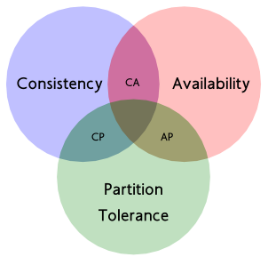
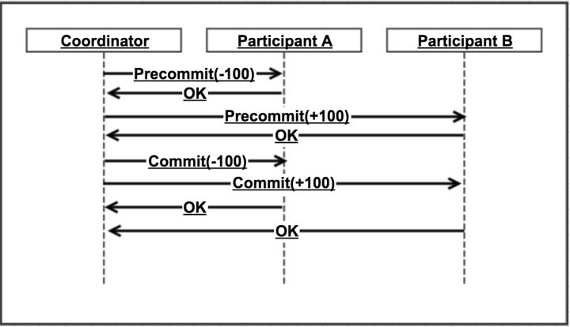
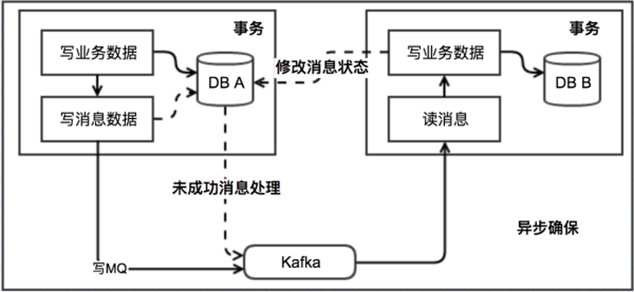
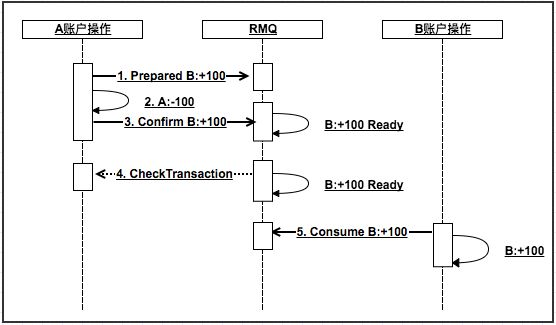

# 分布式系统数据一致性的解决方案

随着互联网的发展，计算机系统规模变得越来越大，常规的将所有业务单元集中部署在一个或者若干个大型机上的集中式架构，已经越来越不能满足当今大型互联网系统的快速发展。分布式服务架构以及微服务架构已经越来越受到业界的青睐。而在目前的应用系统中，不管是集中式的部署架构还是分布式的系统架构，数据的一致性是每个应用系统都需要面临的问题。 

在传统的集中式部署的系统中，应用一般不存在横跨多数据库的情况，借助关系型数据库自带的事务管理机制，关系型数据库具有ACID特性：原子性（Atomicity）、一致性（Consistency）、隔离性（Isolation）、持久性（Durability），保证数据一致性是比较容易的。而在分布式系统中，一个普通的业务功能，内部可能需要调用部署在多个服务器上的服务，并操作多个数据库或分片来实现，情况往往会复杂很多。保证数据一致性也变得更加艰难，再通过传统的关系型数据库的事务机制等单一的技术手段和解决方案，已经无法应对和满足这些复杂的场景了。当然这些问题单纯依靠特定的开源框架和组件并不能解决，更多的还是需要根据自己的业务场景，选择合适的解决方案。

# 一．CAP理论和BASE理论

## 1、CAP理论 

谈及分布式系统，就不能不提到CAP理论，CAP理论由Berkeley的计算机教授Eric Brewer在2000年提出，其核心思想是任何基于网络的数据共享系统最多只能满足数据一致性(Consistency)、可用性(Availability)和网络分区容忍(Partition Tolerance)三个特性中的两个，三个特性的定义如下： 

  
 

一致性（Consistency）：一致性，这个和数据库ACID的一致性类似，但这里关注的是所有数据节点上的数据一致性和正确性，而数据库的ACID关注的是在一个事务内，对数据的一些约束。系统在执行过某项操作后仍然处于一致的状态。在分布式系统中，更新操作执行成功后所有的用户都应该读取到最新值。 
可用性（Availability）：每一个操作总是能够在一定时间内返回结果。需要注意"一定时间"和"返回结果"。"一定时间"是指，系统结果必须在给定时间内返回。"返回结果"是指系统返回操作成功或失败的结果。 
分区容忍性（Partition Tolerance）：是否可以对数据进行分区。这是考虑到性能和可伸缩性。 
在分布式系统中，同时满足"CAP定律"中的"一致性"、"可用性"和"分区容错性"三者是不可能的。在互联网应用的绝大多数的场景，都需要牺牲强一致性来换取系统的高可用性，系统往往只需要保证"最终一致性"，只要这个最终时间是在用户可以接受的范围内即可。 

## 2、BASE理论 

BASE是Basically Available（基本可用）、Soft state（软状态）和Eventually consistent（最终一致性）三个短语的缩写。BASE理论是对CAP中一致性和可用性权衡的结果， 是基于CAP定理逐步演化而来的。BASE理论的核心思想是：即使无法做到强一致性，但每个应用都可以根据自身业务特点，采用适当的方式来使系统达到最终一致性。接下来看一下BASE中的三要素： 

基本可用: 基本可用是指分布式系统在出现不可预知故障的时候，允许损失部分可用性。注意，这绝不等价于系统不可用。 
软状态： 

软状态是指允许系统存在中间状态，并且该中间状态不会影响系统整体可用性。即允许系统在不同节点间副本同步的时候存在延时。 

最终一致性：系统中的所有数据副本经过一定时间后，最终能够达到一致的状态，不需要实时保证系统数据的强一致性。最终一致性是弱一致性的一种特殊情况。 

BASE理论面向的是大型高可用可扩展的分布式系统，和传统的事物ACID特性是相反的，它完全不同于ACID的强一致性模型，而是通过牺牲强一致性来获得可用性，并允许数据在一段时间内是不一致的，但最终达到一致状态。但同时，在实际的分布式场景中，不同业务单元和组件对数据一致性的要求是不同的，因此在具体的分布式系统架构设计过程中，ACID特性和BASE理论往往又会结合在一起。 

根据CAP理论和BASE理论，在分布式系统中，我们无法找到一种能够满足分布式系统所有系统属性的一致性解决方案，如果不想牺牲一致性，我们只能放弃可用性，这显然不能接受。因此，为了保证数据的一致性同时又不影响系统运行的性能，许多分布式系统采用弱一致性来提高性能，一些不同的一致性模型也相继被提出： 

强一致性: 当更新操作完成之后，任何多个后续进程或者线程的访问都会返回最新的更新过的值。这种是对用户最友好的，就是用户上一次写什么，下一次就保证能读到什么。根据 CAP 理论，这种实现需要牺牲可用性。 

弱一致性： 系统并不保证跨进程或者线程的访问都会返回最新的更新过的值。系统在数据写入成功之后，不承诺立即可以读到最新写入的值，也不会具体的承诺多久之后可以读到。 

最终一致性：弱一致性的特定形式。系统保证在没有后续更新的前提下，系统最终返回上一次更新操作的值。在没有故障发生的前提下，不一致窗口的时间主要受通信延迟，系统负载和复制副本的个数影响。DNS 是一个典型的最终一致性系统。 

# 二、数据一致性的几种解决方案 

1. 两阶段提交

两阶段提交需要有一个协调者，来协调两个操作之间的操作流程。当参与方为更多时，其逻辑其实就比较复杂了。

而参与者需要实现两阶段提交协议。Pre commit阶段需要锁住相关资源，commit或rollback时分别进行实际提交或释放资源。

看似还不错。但是考虑到各种异常情况那就比较痛苦了。

举个例子：如下图，执行到提交阶段，调用A的commit接口超时了，协调者该如何做？

我们一般会假设预提交成功后，提交或回滚肯定是成功的（由参与者保障）。

上述情况协调者只能选择继续重试。这也就要求下游接口必须实现幂等（关于幂等的实现下面我们单独再讨论下）。

一般，下游出现故障，不是短时重试能解决的。所以，我们一般也需要有定时去处理中间状态的逻辑。

  
 

总结：这种实现方式实现比较简单，比较适合传统的单体应用，在同一个方法中存在跨数据库操作的情况。但是因为两阶段的提交会创建多次节点的网络通信，通信时间变长后，事务的时间也相对变长，锁定的资源时间也变长，造成资源等待时间也变长，这会带来严重的性能问题，因此大部分高并发服务往往都避免使用二阶段提交协议，所以后来业界又引入了三阶段提交协议来解决该类问题。 

2、非事务型消息队列+本地消息表 

此方案关键是要有个本地消息表，基本思路就是： 

消息生产方，需要额外建一个消息表，并记录消息发送状态。消息表和业务数据要在一个事务里提交。 

消息消费方：处理消息并完成自己的业务逻辑。此时如果本地事务处理成功，那发送给生产方一个confirm消息，表明已经处理成功了。如果处理失败，则将消息放回MQ。 

生产方定时扫描本地消息表，把还没处理完成的消息重新发送一遍，直到本地消息表中记录的该消息为已成功状态。 

  
 

通过上图可以看出，消费方会面临一个问题就是，当消费方完成本地事务处理，给生产方发送CONFIRM消息失败时，生产方由于本地消息表的消息状态没有更新，会进行重试，那么这时候就存在了消息重复投递的问题，这时候消费方收到重复投递过来的消息后，要保证消费者调用业务的服务接口的幂等性，即：如果重复消费，也不能因此影响业务结果，同一消息多次被执行会得到相同的结果。 

总结：这种方式的根本原理就是：将分布式事务转换为多个本地事务，然后依靠重试等方式达到最终一致性。这种方式比较常见。如果MQ自身和业务都具有高可用性，理论上是可以满足大部分的业务场景的。但是由于可能存在的长时间处于中间状态，不建议交易类业务直接使用。

3、事务型消息队列 

事务型消息实际上是一个很理想的想法，目前市面上大部分MQ都不支持事务消息，其中包括目前比较火的kafka。阿里的RocketMQ是可以支持事务型消息的MQ，根据网传的资料，大概了解到RocketMQ的事务消息相当于在普通MQ的基础上，提供了2PC的提交接口。把非事务型消息队列中的消息状态和重发等用中间件形式封装了。 

举个例子，Bob向Smith转账，那我们到底是先发送消息，还是先执行扣款操作？ 

好像都可能会出问题。如果先发消息，扣款操作失败，那么Smith的账户里面会多出一笔钱。反过来，如果先执行扣款操作，后发送消息，那有可能扣款成功了但是消息没发出去，Smith收不到钱。除了上面介绍的通过异常捕获和回滚的方式外，还有没有其他的思路呢？ 

下面以阿里巴巴的RocketMQ中间件为例，分析下其设计和实现思路。 

RMQ的事务消息相对于普通MQ，相当于提供了2PC的提交接口。

生产方需要先发送一个prepared消息给RMQ。如果操作1失败，返回失败。

然后执行本地事务，如果成功了需要发送Confirm消息给RMQ。2失败，则调用RMQ cancel接口。 

那问题是3失败了（或者超时）该如何处理呢？

别急，RMQ考虑到这个问题了。 RMQ会要求你实现一个check的接口。生产方需要实现该接口，并告知RMQ自己本地事务是否执行成功（第4步）。RMQ会定时轮训所有处于pre状态的消息，并调用对应的check接口，以决定此消息是否可以提交。

当然第5步也可能会失败。这时候需要RMQ支持消息重试。处理失败的消息果断时间再进行重试，直到成功为止（超过重试次数后会进死信队列，可能得人肉处理了，因为没用过所以细节不是很了解）。

支持消息重试，这一点也很重要。消息重试机制也不仅仅在这里能用到，还有其他一些特殊的场景，我们会依赖他。下一小节，我们简单探讨一下这个问题。

RMQ还是很强大的。我们认为这个程度的一致性已经能够满足绝大部分互联网应用场景。代价是生产方做了不少额外的事情，但相比没有事务消息情况，确实解放了不少劳动力。

  
 

总结：目前各大知名的电商平台和互联网公司，几乎都是采用类似的设计思路来实现"最终一致性"的。这种方式适合的业务场景广泛，而且比较可靠。不过这种方式技术实现的难度比较大。目前主流的开源MQ（ActiveMQ、RabbitMQ、Kafka）均未实现对事务消息的支持，所以需二次开发。 

4. 补偿交易（Compensating Transaction）

补偿交易，其核心思想是:针对每个操作，都要注册一个与其对应的补偿操作。一般来说操作本身和其补偿（撤销）操作会在一个事务里完成。

当其后续操作失败后，需要按相反顺序完成前面注册的所有撤销操作。

跟2PC比，他的核心价值应该是少了锁资源的代价。流程也相对简单一点。但实际操作中，补偿操作不太好定义，其中间状态处理也会比较棘手。

比如A:-100(补偿为A:+100),B:+100。那么如果B:+100失败后就需要执行A:+100。

5.消息重试

上面多次提到消息重试。如果说事务消息重点解决了生产者和MQ之间的一致性问题，那么重试机制对于确保消费者和MQ之间的一致性是至关重要的。

消息重试，重试顾名思义是要解决消息一次性传递过程中的失败场景。举个例子，支付宝回调商户，然后商户系统挂了，怎么办？答案是重试！

一般来说，消息如果消费失败，就会被放到重试队列。如果是延迟时间固定（比如每次延迟2s），那么只需要按失败的顺序进队列就好了，然后对队首的消息，只有当延迟时间到达才能被消费。
这里会有个水位的概念。如果按时间作为水位，那么期望执行时间大于当前时间的消息才是高于水位以上的。其他消息对consumer不可见。
如果要实现每个消息延迟时间不一样，之前想过一种基于队列的方案是，按秒的维度建多个队列。按执行时间入到不同的队列，一天86400个队列（一般丑陋）。然后cosumer按时间消费不同队列。

当然如果不依赖队列可以有更灵活的方案。

