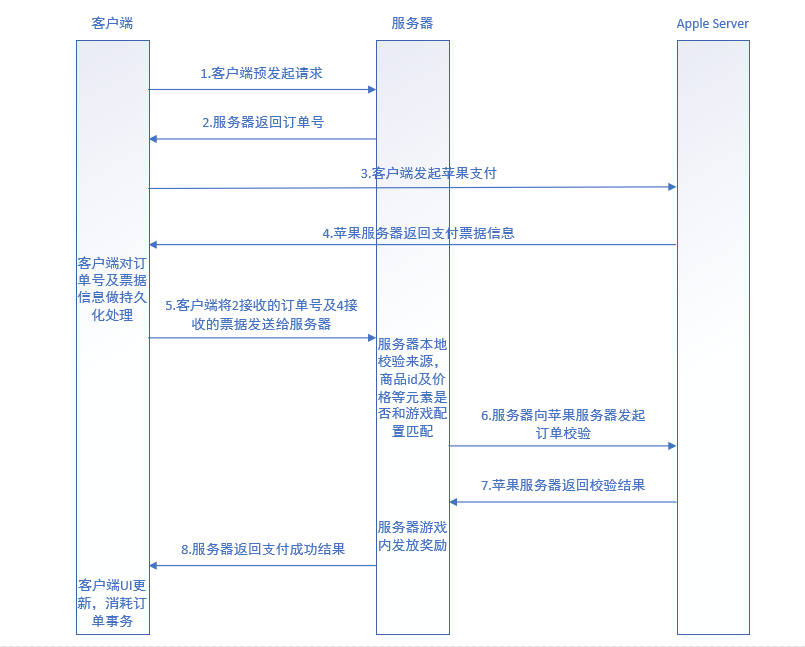

# 支付系统

下图是支付系统的设计框架

  
 

支付的核心是保证支付环境的安全性和涉及数据的一致性。

下面是几种保证安全性，一致性的一些做法和一些过程中的问题：

# 跨app攻击

通过在别的app中拿到receipt,然后发送到我们app中。因为这个receipt是合法的而且apple不会验证请求的源,所以这个receipt是可以验证通过的。

对于这种情况,我们可以判断apple verify的返回值apple_callback_data中对应的bundle_id和我们app的bundle_id是否一样来进行验证。

# 重复验证攻击

因为同一个receipt,如果第一次验证成功,那么之后每次验证都会成功。如果服务端没有判重机制,就会导致一个receipt被当做多次充值处理。

为了预防这种情况,我们可以将receipt做一次md5得到receipt_md5, 每次发送充值请求的时候就按照receipt_md5判重,如果重复就停止商品发放。

# 关于退款的订单

用户退款的订单有可能依然在App Receipt中出现，因此App服务器实现验证的时候需要能够识别出已经被退款的订单，不至于给退款的订单发货（甚至发两次货）。

被退款订单的唯一标识是：它带有一个cancellation_date字段。

# 验证请求的结果返回

iOS 7新的App Receipt在验证完毕后，App Store服务器返回的验证结果（status）所表达的含义发生了变化。如果返回status=0，那么只是表示整个App的票据验证通过，并不表示票据中所包含的每个IAP receipt都有效。甚至有可能App Receipt中根本不包含任何IAP receipt，status也可以是0。

另外，由于App Receipt可能包含多个IAP receipt，因此App服务器并不能保证所有IAP receipt一次性都发货成功。

所以，在设计发货请求的响应参数的时候，一定要能够区分出如下几种case：

全部发货成功；
部分发货成功；
根本不存在IAP receipt

# 验证请求延迟大

App服务器在国内连接App Store服务器进行票据验证时，网络延迟较大。一般最低也要200多ms，而在大的时候能超过7s。

因此，如果有条件，建议给App Store服务器的验证请求加上国际代理（比如使用HTTP CONNECT tunneling），降低请求延迟。

# IAP支付事务机制

在IAP中能够防止掉单问题的方式，是利用事务机制。IAP中的每次支付行为被抽象成一个事务（SKPaymentTransaction），只有事务被正常结束（finishTransaction:）该次支付行为才算完成。即使一次支付中途被中断，这次事务也并没有丢失。假设支付没有完成App就退出了（比如突然崩溃了），那么当下次App重启之后（调用了addTransactionObserver:），之前被中断的事务会接着进行。

但是，IAP提供的这种基本的事务机制，对于支付流程的完整性只能提供一个比较弱的保证。它的缺点有以下几个：

如果用户扣款成功后由于网络原因而导致App客户端同App服务器通信失败（App未立即退出），那么当前支付就没能正常发货。而IAP的事务机制一般要等到App退出后下次启动才能恢复（IAP要在addTransactionObserver:被调用后恢复上次事务，而addTransactionObserver:在App生命周期内一般只调用一次）。这样，在用户扣款成功后直到App下次启动，都没有机会让掉单的订单得到恢复。这段时间可能会比较长。

如果错误发生在第5步App服务器和App Store服务器之间，那么情况同上，也要等到下次App启动才有可能恢复事务，得到重试发货的机会。

如果获取票据（receipt）使用的是iOS 7.0之前的接口（通过SKPaymentTransaction的transactionReceipt属性，该属性已经从iOS 7.0开始过期），那么会产生更多问题。比如连续产生了多个未完成的订单事务，那么有可能只能恢复最后一个。
