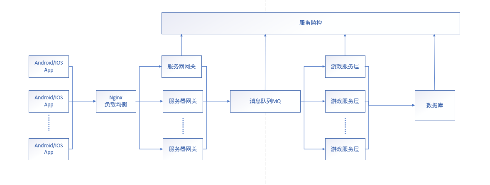

# 秒杀系统

下图是秒杀系统的设计框架

  
 

秒杀的核心问题就是极高并发处理，由于系统要在瞬时承受平时数十倍甚至上百倍的流量，这往往超出系统上限，因此处理秒杀的核心思路是流控和性能优化。

# 流量控制

## 客户端流控

在客户端进行访问限制，较为合适的做法是屏蔽用户高频请求，比如在网页中设置5s一次访问限制，可以防止用户过度刷接口。这种做法较为简单，用户体验也尚可，可以拦截大部分小白用户的异常访问，比如狂刷F5。关键是要明确告知用户，如果像一些抢购系统那样假装提交一个排队页面但又不回应任何请求，就是赤裸裸的欺骗了。

## 客户端分流

秒杀商品页面重新设计，不使用网站原来的商品详情页面，页面内容静态化：商品描述，商品参数，成交记录，用户评价全部写入一个静态页面，用户请求不需要经过应用服务器的业务逻辑处理，也不需要访问数据库。所以秒杀商品服务不需要部署动态的Web服务器、数据库服务器。可以通过CDN缓存静态资源，来抗峰值。 

## 后端系统流控

对于后端系统的访问限制可以通过异步处理、消息队列、并发限制等方式实现。核心思路是保证后端系统的压力维持在可以正常处理的水平。对于超过系统负载的请求，可以选择直接拒绝，以此来对系统进行保护，保证在极限压力的情况下，系统有合理范围内的处理能力。

限制同一IP，同一用户的高频访问。

# 性能优化

## 读取加速

在秒杀活动中，数据需求一般都是读多写少。20万人抢2000个商品，最后提交的订单最多也就2000个，但是在秒杀过程中，这20万人会一直产生大量的读取请求。因此可以使用缓存服务对用户请求进行缓存优化，把一些高频访问的内容放到缓存中去。

## 系统扩容

这项内容是在云计算环境下才成为可能，相对于传统的IT行业，云计算提供了快速的系统交付能力（min VS. day），因此可以做到按需分配，在业务需要时实现资源的并行扩展。

对一次成功的秒杀活动来说，无论如何限流，如何优化系统，最终产生数倍于正常请求的压力是很正常的。因此临时性的系统扩容必不可少，系统扩容包括以下3个方面。

增加系统规格：可以预先增加系统容量，比如提高系统带宽、购买更多流量等。
服务扩展：无状态服务+负载均衡可以直接进行水平扩展，有状态的服务则需要进行较为复杂的垂直扩展，增大实例规格。
后端系统扩容：缓存服务和数据库服务都可以进行容量扩展。

## 突然增加的网络及服务器带宽处理

假设商品页面大小200K（主要是商品图片大小），那么需要的网络和服务器带宽是2G（200K×10,000），这些网络带宽是因为秒杀活动新增的，超过网站平时使用的带宽。

对于因为秒杀新增的网络带宽，必须和运营商重新购买或者租借。为了减轻网站服务器的压力，需要将秒杀商品页面缓存在CDN，同样需要和CDN服务商临时租借新增的出口带宽。

## 对现有网站业务造成冲击处理

秒杀活动只是网站营销的一个附加活动，这个活动具有时间短，并发访问量大的特点，如果和网站原有应用部署在一起，必然会对现有业务造成冲击，稍有不慎可能导致整个网站瘫痪。

为了避免因为秒杀活动的高并发访问而拖垮整个网站，使整个网站不必面对蜂拥而来的用户访问，将秒杀系统独立部署，如果需要，还可以使用独立的域名，以和网站完全隔离，即使秒杀系统崩溃了，也不会对网站造成任何影响。

