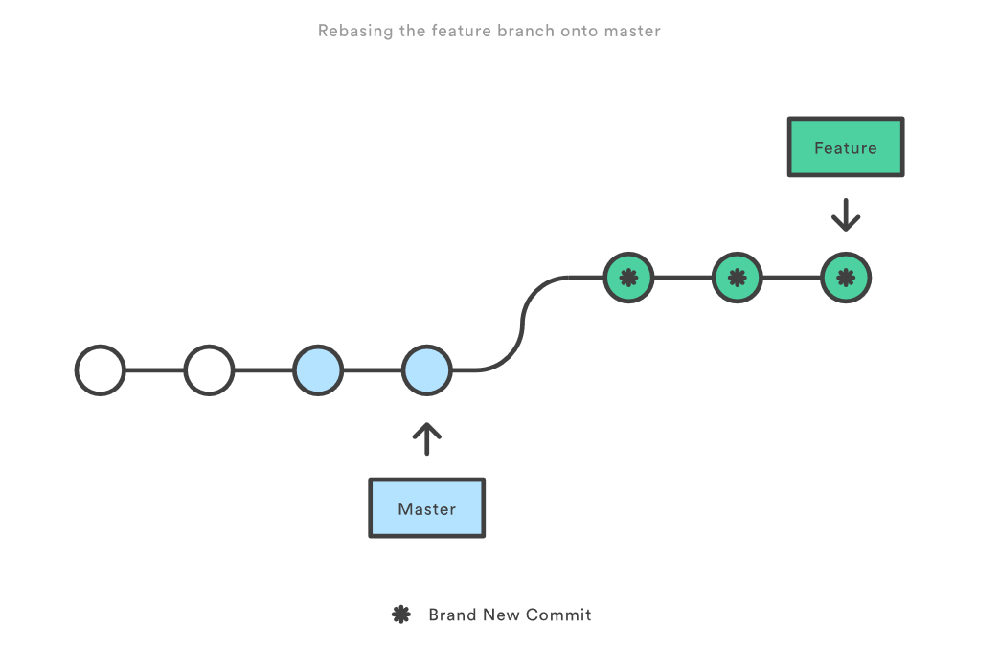

# github上fork了别人的项目后，再同步更新别人的提交

git remote -v #查看远程信息
git remote add upstream git@github.com:xxx/xxx.git #添加远程仓库（git remote remove xxx可以删除）
git fetch upstream #从源仓库更新代码
git merge upstream/master #更新并合并到自己的仓库代码
git push #提交代码

# git merge 出现nano编辑提交界面

这个是使用nano进行编辑提交的页面，退出方法为：

Ctrl + X然后输入y再然后回车，就可以退出了

如果你想把默认编辑器换成别的：

在GIT配置中设置 core.editor: git config --global core.editor "vim"

设置git配置: git config --global core.editor "vim"
或者
设置环境变量GIT_EDITOR: export GIT_EDITOR=vim

# git rebase

作为 merge 的替代选择，你可以像下面这样将 feature 分支并入 master 分支：

git checkout feature
git rebase master

它会把整个 feature 分支移动到 master 分支的后面，有效地把所有 master 分支上新的提交并入过来。但是，rebase 为原分支上每一个提交创建一个新的提交，重写了项目历史，并且不会带来合并提交。

  
 

rebase最大的好处是你的项目历史会非常整洁。首先，它不像 git merge 那样引入不必要的合并提交。其次，如上图所示，rebase 导致最后的项目历史呈现出完美的线性——你可以从项目终点到起点浏览而不需要任何的 fork。这让你更容易使用 git log、git bisect 和 gitk 来查看项目历史。
